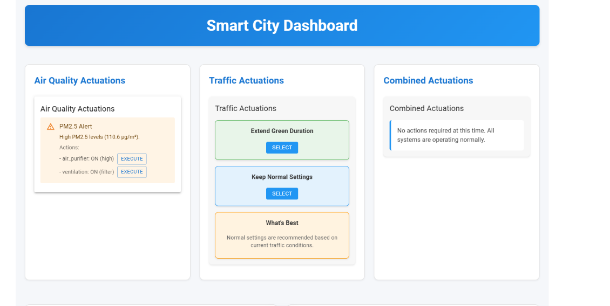
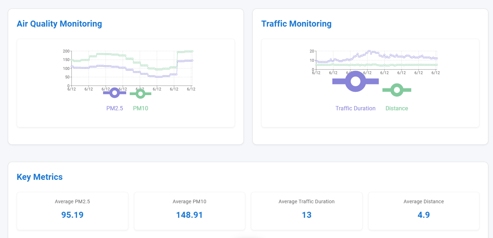

# Smart City Command Center 

A modern, real-time dashboard for monitoring and controlling smart city infrastructure, featuring air quality monitoring, traffic management, and automated response systems.


## Dashboard Overview

### Smart City Actuations
<div align="center">
  
</div>

The dashboard provides real-time control over various city infrastructure components, including:
- Air Quality Actuations for managing air quality parameters
- Traffic Control Systems for optimizing traffic flow
- Combined Infrastructure Management for coordinated responses

### Monitoring and Key Metrics
<div align="center">
  
</div>

Real-time monitoring of critical city metrics:
- Air Quality Trends showing PM2.5 and PM10 levels over time
- Traffic Flow Analysis with duration and distance metrics
- Key Performance Indicators including average PM2.5, PM10, traffic duration, and overall efficiency

## Features

- **Real-time Monitoring**
  - Air Quality Metrics (PM2.5, PM10, NO2, O3)
  - Traffic Flow Analysis
  - Environmental Data Visualization

- **Smart Infrastructure Control**
  - Traffic Light Management
  - Digital Road Signs
  - Urban Ventilation Systems

- **Automated Response System**
  - Intelligent recommendations based on data analysis
  - Automatic infrastructure adjustments
  - Real-time alerts and notifications

## Project Structure
```
project/
├── frontend/             # React frontend application
│   ├── public/          # Static files
│   ├── src/             # Source code
│   └── package.json     # Frontend dependencies
├── app.py               # Flask backend server
└── requirements.txt     # Python dependencies
```

## Setup Instructions

### Prerequisites
- Python 3.8 or higher
- Node.js 14 or higher
- npm (Node Package Manager)
- Git

### Step 1: Clone the Repository
```bash
git clone https://github.com/SHEEEEEEEEEEEEEEEEN11/Smart-City-Dashboard.git
cd Smart-City-Dashboard
```

### Step 2: Backend Setup
1. Create and activate a Python virtual environment:
```bash
python -m venv venv
venv\Scripts\activate  # On Windows
```

2. Install Python dependencies:
```bash
pip install -r requirements.txt
```

3. Start the Flask backend server:
```bash
python app.py
```
The backend will run on http://localhost:5000

### Step 3: Frontend Setup
1. Navigate to the frontend directory:
```bash
cd frontend
```

2. Install Node.js dependencies:
```bash
npm install
```

3. Start the React development server:
```bash
npm start
```
The frontend will automatically open in your browser at http://localhost:3000

## Accessing the Dashboard
Once both servers are running:
1. Open your web browser
2. Navigate to http://localhost:3000
3. The dashboard should display real-time data visualizations including:
   - PM2.5 levels
   - PM10 levels
   - Traffic duration metrics
   - Travel distance data

## Troubleshooting
If you encounter any issues:

1. **Backend Issues**
   - Ensure Python virtual environment is activated
   - Verify all Python dependencies are installed
   - Check if port 5000 is available

2. **Frontend Issues**
   - Clear npm cache: `npm cache clean --force`
   - Delete node_modules and reinstall: 
     ```bash
     rm -rf node_modules
     npm install
     ```
   - Verify port 3000 is not in use

3. **Data Loading Issues**
   - Ensure both backend and frontend servers are running
   - Check browser console for any error messages
   - Verify network connectivity

## Quick Start

### Prerequisites
- Node.js (v14 or higher)
- Python (v3.8 or higher)
- pip (Python package manager)
- Git

### Installation

1. Clone the repository:
```bash
git clone https://github.com/SHEEEEEEEEEEEEEEEEN11/Smart-City-Dashboard.git
cd Smart-City-Dashboard
```

2. Install backend dependencies:
```bash
# Create and activate a virtual environment (recommended)
# On Windows:
python -m venv venv
venv\Scripts\activate

# Install dependencies
pip install -r requirements.txt
```

3. Install frontend dependencies:
```bash
cd frontend
npm install
```

### Running the Application

1. Start the backend server:
```bash
# Make sure you're in the project root directory
# and virtual environment is activated (if using one)
python app.py
```

2. Start the frontend development server:
```bash
# Open a new terminal window
cd frontend
npm start
```

The application should now be running at:
- Frontend: http://localhost:3000
- Backend API: http://localhost:5000

### Troubleshooting

If you encounter any issues:

1. Node.js version issues:
   ```bash
   # Check your Node.js version
   node --version
   # Should be v14 or higher
   ```

2. Python version issues:
   ```bash
   # Check your Python version
   python --version
   # Should be 3.8 or higher
   ```

3. Port conflicts:
   - Make sure ports 3000 and 5000 are not in use
   - You can change the backend port in `app.py`
   - Frontend port can be changed by setting PORT environment variable

4. Dependencies issues:
   ```bash
   # For backend issues
   pip install --upgrade -r requirements.txt

   # For frontend issues
   cd frontend
   rm -rf node_modules package-lock.json
   npm install
   ```

### Required Python Packages
```
flask==2.0.1
flask-cors==3.0.10
python-dotenv==0.19.0
requests==2.26.0
pandas>=1.3.0
numpy>=1.21.0
scikit-learn>=0.24.2
```

### Required Node.js Packages
```
@mui/material: ^5.13.0
@mui/icons-material: ^6.2.0
react: ^18.2.0
recharts: ^2.6.2
axios: ^1.4.0
```

## System Architecture

### Frontend
- React.js with Material-UI
- Real-time data visualization using Recharts
- Responsive design for all device sizes

### Backend
- Flask REST API
- Real-time data processing
- Smart actuation system for infrastructure control

### Data Processing
- Time-series analysis
- Cross-correlation between air quality and traffic data
- Automated decision-making system

## Data Sources

The dashboard integrates data from multiple sources:
- Air Quality Monitoring Stations
- Traffic Management Systems
- Environmental Sensors

## API Endpoints

### Data Endpoints
- `GET /api/data` - Retrieve current sensor data
- `GET /api/statistics` - Get statistical analysis

### Control Endpoints
- `POST /api/actuate/traffic-lights` - Control traffic signals
- `POST /api/actuate/signs` - Update digital road signs
- `POST /api/actuate/ventilation` - Manage ventilation systems

## Contributing

1. Fork the repository
2. Create your feature branch (`git checkout -b feature/AmazingFeature`)
3. Commit your changes (`git commit -m 'Add some AmazingFeature'`)
4. Push to the branch (`git push origin feature/AmazingFeature`)
5. Open a Pull Request

## License

This project is licensed under the MIT License - see the [LICENSE](LICENSE) file for details.

## Acknowledgments

Your Name - your.email@example.com
Project Link: [https://github.com/SHEEEEEEEEEEEEEEEEN11/Smart-City-Dashboard](https://github.com/SHEEEEEEEEEEEEEEEEN11/Smart-City-Dashboard)

## Contributing

Feel free to contribute to this project by opening issues or submitting pull requests on our [GitHub repository](https://github.com/SHEEEEEEEEEEEEEEEEN11/Smart-City-Dashboard).

## License

This project is open source and available under the MIT License.

---
Made with by [SHEEEEEEEEEEEEEEEEN11](https://github.com/SHEEEEEEEEEEEEEEEEN11)
